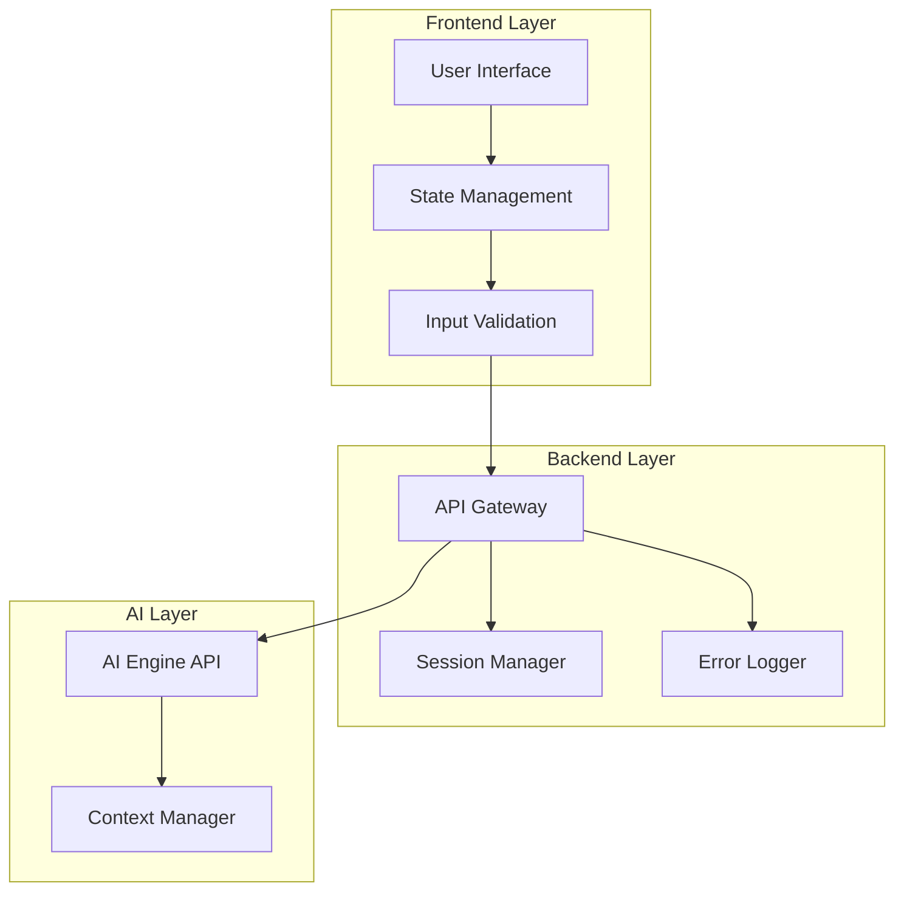
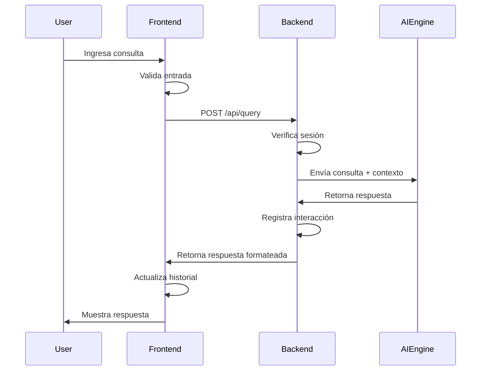

# Design Document - Smart Tribut

## Overview

Smart Tribut es una aplicación web de página única (SPA) que proporciona asistencia tributaria mediante inteligencia artificial. El sistema está diseñado con una arquitectura cliente-servidor donde el frontend maneja la interfaz de usuario y el backend integra servicios de IA para procesar consultas fiscales.

### Objetivos del Diseño

- Proporcionar una interfaz intuitiva y responsiva para consultas tributarias
- Integrar capacidades de IA para generar respuestas contextualizadas
- Mantener el historial de conversación durante la sesión activa
- Garantizar la seguridad y privacidad de las consultas del usuario
- Ofrecer una experiencia consistente en múltiples dispositivos

### Alcance Técnico

El diseño cubre:
- Interfaz de usuario web responsiva
- Sistema de gestión de sesiones y conversaciones
- Integración con motor de IA (API externa)
- Manejo de errores y estados de carga
- Validación de entrada y formateo de salida

## Architecture

### Arquitectura General

Smart Tribut utiliza una arquitectura de tres capas:



### Componentes Principales

1. **Frontend (React/Vue/Vanilla JS)**
   - Componente de entrada de consultas
   - Componente de visualización de conversación
   - Componente de gestión de sesiones
   - Sistema de notificaciones y errores

2. **Backend (Node.js/Python)**
   - API REST para comunicación cliente-servidor
   - Gestor de sesiones en memoria o base de datos
   - Proxy para el motor de IA
   - Sistema de logging y monitoreo

3. **AI Integration**
   - Cliente para API de IA (OpenAI, Anthropic, etc.)
   - Gestor de contexto conversacional
   - Procesador de prompts especializados en temas tributarios

### Flujo de Datos



## Components and Interfaces

### Frontend Components

#### 1. QueryInput Component
```typescript
interface QueryInputProps {
  onSubmit: (query: string) => void;
  isLoading: boolean;
  maxLength: number;
}

interface QueryInputState {
  value: string;
  error: string | null;
}
```

Responsabilidades:
- Capturar entrada del usuario
- Validar longitud y contenido
- Deshabilitar durante procesamiento
- Mostrar errores de validación

#### 2. ConversationDisplay Component
```typescript
interface Message {
  id: string;
  type: 'query' | 'response';
  content: string;
  timestamp: Date;
  references?: LegalReference[];
}

interface ConversationDisplayProps {
  messages: Message[];
  isLoading: boolean;
}
```

Responsabilidades:
- Renderizar historial de mensajes
- Formatear respuestas con markdown
- Destacar referencias legales
- Mostrar timestamps
- Auto-scroll a nuevos mensajes

#### 3. SessionControl Component
```typescript
interface SessionControlProps {
  onNewSession: () => void;
  onDeleteHistory: () => void;
  sessionId: string;
}
```

Responsabilidades:
- Iniciar nueva sesión
- Confirmar limpieza de historial
- Mostrar ID de sesión actual

#### 4. DisclaimerBanner Component
```typescript
interface DisclaimerBannerProps {
  isFirstQuery: boolean;
  onAcknowledge: () => void;
}
```

Responsabilidades:
- Mostrar descargo de responsabilidad
- Permanecer visible en la interfaz
- Destacar en primera consulta

### Backend API Endpoints

#### POST /api/query
```typescript
interface QueryRequest {
  sessionId: string;
  query: string;
  conversationHistory?: Message[];
}

interface QueryResponse {
  success: boolean;
  response: string;
  references: LegalReference[];
  timestamp: string;
  error?: ErrorDetails;
}
```

#### POST /api/session/new
```typescript
interface NewSessionRequest {
  previousSessionId?: string;
}

interface NewSessionResponse {
  sessionId: string;
  createdAt: string;
}
```

#### DELETE /api/session/:sessionId
```typescript
interface DeleteSessionResponse {
  success: boolean;
  message: string;
}
```

### AI Engine Integration

#### AIService Interface
```typescript
interface AIService {
  processQuery(
    query: string,
    context: ConversationContext
  ): Promise<AIResponse>;
  
  validateQuery(query: string): ValidationResult;
  
  formatResponse(
    rawResponse: string
  ): FormattedResponse;
}

interface ConversationContext {
  sessionId: string;
  history: Message[];
  maxContextLength: number;
}

interface AIResponse {
  content: string;
  references: LegalReference[];
  needsClarification: boolean;
  clarificationPrompt?: string;
}
```

## Data Models

### Message Model
```typescript
interface Message {
  id: string;              // UUID
  sessionId: string;       // UUID de la sesión
  type: 'query' | 'response';
  content: string;         // Texto de la consulta o respuesta
  timestamp: Date;         // Momento de creación
  references?: LegalReference[];
  metadata?: {
    processingTime?: number;
    model?: string;
    tokenCount?: number;
  };
}
```

### Session Model
```typescript
interface Session {
  id: string;              // UUID
  createdAt: Date;
  lastActivityAt: Date;
  messages: Message[];
  userId?: string;         // Opcional si hay autenticación
  status: 'active' | 'ended';
  settings: {
    language: string;      // 'es' por defecto
    maxHistoryLength: number;
  };
}
```

### LegalReference Model
```typescript
interface LegalReference {
  id: string;
  title: string;           // Nombre de la ley o artículo
  article?: string;        // Número de artículo
  url?: string;            // Enlace a la fuente oficial
  excerpt?: string;        // Fragmento relevante
  jurisdiction: string;    // País/región aplicable
}
```

### Error Model
```typescript
interface ErrorDetails {
  code: string;            // Código de error (e.g., 'AI_TIMEOUT')
  message: string;         // Mensaje para el usuario
  technicalDetails?: string; // Detalles técnicos para logging
  retryable: boolean;      // Si el usuario puede reintentar
  timestamp: Date;
}
```

### Validation Models
```typescript
interface ValidationResult {
  isValid: boolean;
  errors: ValidationError[];
}

interface ValidationError {
  field: string;
  message: string;
  code: string;
}
```

### Storage Schema

Para sesiones en memoria (desarrollo):
```typescript
const sessionStore = new Map<string, Session>();
```

Para persistencia (producción):
```sql
-- Sessions table
CREATE TABLE sessions (
  id VARCHAR(36) PRIMARY KEY,
  created_at TIMESTAMP NOT NULL,
  last_activity_at TIMESTAMP NOT NULL,
  status VARCHAR(20) NOT NULL,
  settings JSON,
  user_id VARCHAR(36)
);

-- Messages table
CREATE TABLE messages (
  id VARCHAR(36) PRIMARY KEY,
  session_id VARCHAR(36) NOT NULL,
  type VARCHAR(20) NOT NULL,
  content TEXT NOT NULL,
  timestamp TIMESTAMP NOT NULL,
  metadata JSON,
  FOREIGN KEY (session_id) REFERENCES sessions(id) ON DELETE CASCADE
);

-- Legal references table
CREATE TABLE legal_references (
  id VARCHAR(36) PRIMARY KEY,
  message_id VARCHAR(36) NOT NULL,
  title VARCHAR(255) NOT NULL,
  article VARCHAR(100),
  url TEXT,
  excerpt TEXT,
  jurisdiction VARCHAR(100),
  FOREIGN KEY (message_id) REFERENCES messages(id) ON DELETE CASCADE
);
```


## Correctness Properties

*Una propiedad es una característica o comportamiento que debe ser verdadero en todas las ejecuciones válidas de un sistema - esencialmente, una declaración formal sobre lo que el sistema debe hacer. Las propiedades sirven como puente entre las especificaciones legibles por humanos y las garantías de corrección verificables por máquinas.*

### Property 1: Query Length Validation

*Para cualquier* cadena de texto de hasta 500 caracteres, cuando se envía como consulta, el sistema debe aceptarla sin errores de validación de longitud.

**Validates: Requirements 1.2**

### Property 2: Spanish Language Support

*Para cualquier* texto en español válido, cuando se envía como consulta, el sistema debe procesarlo sin errores de codificación o rechazo de caracteres.

**Validates: Requirements 1.3**

### Property 3: Response Formatting and Display

*Para cualquier* respuesta generada que contenga formato de texto (párrafos, listas, énfasis), el sistema debe renderizarla con los elementos HTML apropiados y en un formato legible.

**Validates: Requirements 3.1, 3.2**

### Property 4: Legal Reference Highlighting

*Para cualquier* respuesta que incluya referencias legales, el sistema debe aplicar estilos distintivos (clase CSS, color, o formato) a dichas referencias para diferenciarlas del texto normal.

**Validates: Requirements 3.3**

### Property 5: Response Timestamp Display

*Para cualquier* respuesta mostrada en la interfaz, debe incluir un timestamp visible que indique cuándo fue generada.

**Validates: Requirements 3.4**

### Property 6: Conversation History Persistence

*Para cualquier* consulta enviada durante una sesión activa, después de ser procesada, debe aparecer en el historial de conversación junto con su respuesta correspondiente.

**Validates: Requirements 4.1, 4.3**

### Property 7: Chronological Message Ordering

*Para cualquier* secuencia de mensajes en una sesión, cuando se muestran en la interfaz, deben aparecer ordenados cronológicamente según sus timestamps, con los mensajes más antiguos primero.

**Validates: Requirements 4.2**

### Property 8: AI Error Handling

*Para cualquier* fallo en el procesamiento de una consulta por parte del AI_Engine, el sistema debe mostrar un mensaje de error al usuario sin bloquear la interfaz.

**Validates: Requirements 5.1**

### Property 9: Connection Error Notification

*Para cualquier* pérdida de conexión con el AI_Engine, el sistema debe notificar al usuario y proporcionar opciones para reintentar la operación.

**Validates: Requirements 5.2**

### Property 10: Error Logging

*Para cualquier* error que ocurra en el sistema (AI, red, validación), debe registrarse en el sistema de logging con detalles suficientes para debugging (timestamp, tipo de error, contexto).

**Validates: Requirements 5.3**

### Property 11: System Resilience After Errors

*Para cualquier* error mostrado al usuario, después de su visualización, el sistema debe mantener su funcionalidad permitiendo nuevas consultas y operaciones.

**Validates: Requirements 5.4**

### Property 12: Responsive Layout Adaptation

*Para cualquier* cambio en el tamaño del viewport entre 320px y 1920px de ancho, el sistema debe adaptar su layout manteniendo todos los elementos principales visibles y accesibles.

**Validates: Requirements 6.3**

### Property 13: Cross-Size Functionality

*Para cualquier* tamaño de viewport soportado (≥320px), las funciones principales (enviar consulta, ver historial, iniciar nueva sesión) deben permanecer operativas.

**Validates: Requirements 6.4**

### Property 14: New Session History Clearing

*Para cualquier* sesión activa con historial de conversación, cuando se inicia una nueva sesión, el historial debe vaciarse completamente mostrando cero mensajes.

**Validates: Requirements 7.2**

### Property 15: New Session Confirmation

*Para cualquier* acción de iniciar nueva sesión, el sistema debe mostrar un mensaje de confirmación al usuario indicando que la nueva sesión ha comenzado.

**Validates: Requirements 7.4**

### Property 16: Encrypted Communication

*Para cualquier* comunicación entre el cliente y el servidor (envío de consultas, recepción de respuestas), debe realizarse a través de conexiones HTTPS encriptadas.

**Validates: Requirements 8.1**

## Error Handling

### Error Categories

El sistema maneja las siguientes categorías de errores:

#### 1. Validation Errors
- **Causa**: Entrada inválida del usuario
- **Ejemplos**: Query vacío, longitud excedida
- **Manejo**: 
  - Mostrar mensaje de validación específico
  - No enviar request al backend
  - Mantener el contenido del input para corrección
  - No registrar como error del sistema

#### 2. Network Errors
- **Causa**: Problemas de conectividad
- **Ejemplos**: Timeout, conexión perdida, DNS failure
- **Manejo**:
  - Mostrar notificación de error de red
  - Ofrecer botón de reintento
  - Guardar la consulta para reintento automático
  - Registrar en logs con nivel WARNING

#### 3. AI Engine Errors
- **Causa**: Fallos en el procesamiento de IA
- **Ejemplos**: API rate limit, modelo no disponible, respuesta inválida
- **Manejo**:
  - Mostrar mensaje de error amigable
  - Ofrecer reintento después de delay
  - Registrar detalles técnicos en logs
  - Mantener sesión activa

#### 4. Server Errors
- **Causa**: Errores internos del backend
- **Ejemplos**: 500 Internal Server Error, database failure
- **Manejo**:
  - Mostrar mensaje genérico al usuario
  - Registrar stack trace completo
  - Notificar a sistema de monitoreo
  - Ofrecer contacto de soporte si persiste

### Error Response Format

```typescript
interface ErrorResponse {
  error: {
    code: string;           // Código único del error
    message: string;        // Mensaje para el usuario
    details?: string;       // Detalles técnicos (solo en dev)
    retryable: boolean;     // Si se puede reintentar
    retryAfter?: number;    // Segundos antes de reintentar
  };
  timestamp: string;
  requestId: string;        // Para tracking
}
```

### Error Codes

```typescript
enum ErrorCode {
  // Validation (1xxx)
  EMPTY_QUERY = 'ERR_1001',
  QUERY_TOO_LONG = 'ERR_1002',
  INVALID_SESSION = 'ERR_1003',
  
  // Network (2xxx)
  NETWORK_TIMEOUT = 'ERR_2001',
  CONNECTION_LOST = 'ERR_2002',
  DNS_FAILURE = 'ERR_2003',
  
  // AI Engine (3xxx)
  AI_TIMEOUT = 'ERR_3001',
  AI_RATE_LIMIT = 'ERR_3002',
  AI_UNAVAILABLE = 'ERR_3003',
  AI_INVALID_RESPONSE = 'ERR_3004',
  
  // Server (5xxx)
  INTERNAL_ERROR = 'ERR_5001',
  DATABASE_ERROR = 'ERR_5002',
  SERVICE_UNAVAILABLE = 'ERR_5003',
}
```

### Error Logging Strategy

```typescript
interface LogEntry {
  level: 'ERROR' | 'WARNING' | 'INFO';
  timestamp: Date;
  errorCode: string;
  message: string;
  context: {
    sessionId?: string;
    userId?: string;
    endpoint?: string;
    requestId?: string;
  };
  stackTrace?: string;
  metadata?: Record<string, any>;
}
```

Niveles de logging:
- **ERROR**: Fallos críticos que impiden operación (server errors, AI failures)
- **WARNING**: Problemas recuperables (network timeouts, rate limits)
- **INFO**: Eventos normales del sistema (nueva sesión, query procesado)

### Retry Strategy

```typescript
interface RetryConfig {
  maxAttempts: number;      // 3 intentos por defecto
  initialDelay: number;     // 1000ms
  maxDelay: number;         // 10000ms
  backoffMultiplier: number; // 2 (exponential backoff)
  retryableErrors: ErrorCode[];
}
```

Errores con reintento automático:
- Network timeouts
- AI rate limits (con backoff)
- Temporary server unavailability

Errores sin reintento:
- Validation errors
- Invalid session
- Permanent AI failures

### User-Facing Error Messages

Mensajes en español, claros y accionables:

```typescript
const errorMessages: Record<ErrorCode, string> = {
  [ErrorCode.EMPTY_QUERY]: 'Por favor, ingresa una consulta antes de enviar.',
  [ErrorCode.QUERY_TOO_LONG]: 'La consulta es demasiado larga. Máximo 500 caracteres.',
  [ErrorCode.NETWORK_TIMEOUT]: 'La conexión tardó demasiado. Por favor, intenta nuevamente.',
  [ErrorCode.AI_TIMEOUT]: 'El procesamiento está tardando más de lo esperado. Intenta con una consulta más simple.',
  [ErrorCode.AI_RATE_LIMIT]: 'Hemos alcanzado el límite de consultas. Por favor, espera un momento.',
  [ErrorCode.INTERNAL_ERROR]: 'Ocurrió un error inesperado. Nuestro equipo ha sido notificado.',
  // ... más mensajes
};
```

## Testing Strategy

### Overview

Smart Tribut implementará una estrategia de testing dual que combina:
- **Unit tests**: Para verificar ejemplos específicos, casos edge y condiciones de error
- **Property-based tests**: Para verificar propiedades universales a través de múltiples inputs generados

Esta combinación asegura cobertura comprehensiva donde los unit tests capturan bugs concretos y los property tests verifican corrección general.

### Property-Based Testing

#### Framework Selection

Para JavaScript/TypeScript: **fast-check**
```bash
npm install --save-dev fast-check
```

Para Python: **Hypothesis**
```bash
pip install hypothesis
```

#### Configuration

Cada property test debe ejecutarse con mínimo 100 iteraciones para asegurar cobertura adecuada:

```typescript
// fast-check configuration
import fc from 'fast-check';

fc.assert(
  fc.property(/* generators */, (/* params */) => {
    // test logic
  }),
  { numRuns: 100 } // Mínimo 100 iteraciones
);
```

#### Property Test Tags

Cada property test debe incluir un comentario que referencie la propiedad del documento de diseño:

```typescript
/**
 * Feature: smart-tribut, Property 1: Query Length Validation
 * Para cualquier cadena de texto de hasta 500 caracteres, cuando se envía como consulta,
 * el sistema debe aceptarla sin errores de validación de longitud.
 */
test('property: query length validation', () => {
  fc.assert(
    fc.property(
      fc.string({ maxLength: 500 }),
      (query) => {
        const result = validateQuery(query);
        expect(result.isValid).toBe(true);
        expect(result.errors).not.toContainEqual(
          expect.objectContaining({ code: 'QUERY_TOO_LONG' })
        );
      }
    ),
    { numRuns: 100 }
  );
});
```

### Unit Testing Strategy

#### Frontend Unit Tests

**Framework**: Jest + React Testing Library (si se usa React) o Vitest

**Áreas de enfoque**:
1. Componentes individuales
2. Validación de entrada
3. Formateo de respuestas
4. Manejo de estados

**Ejemplos de unit tests**:

```typescript
// Ejemplo específico: empty query validation
test('empty query shows validation error', () => {
  const { getByRole, getByText } = render(<QueryInput />);
  const input = getByRole('textbox');
  const submitButton = getByRole('button', { name: /enviar/i });
  
  fireEvent.click(submitButton);
  
  expect(getByText(/ingresa una consulta/i)).toBeInTheDocument();
});

// Edge case: query at exact limit
test('query with exactly 500 characters is accepted', () => {
  const query = 'a'.repeat(500);
  const result = validateQuery(query);
  expect(result.isValid).toBe(true);
});

// Edge case: query over limit
test('query with 501 characters is rejected', () => {
  const query = 'a'.repeat(501);
  const result = validateQuery(query);
  expect(result.isValid).toBe(false);
  expect(result.errors[0].code).toBe('QUERY_TOO_LONG');
});
```

#### Backend Unit Tests

**Framework**: Jest (Node.js) o pytest (Python)

**Áreas de enfoque**:
1. API endpoints
2. Session management
3. Error handling
4. AI service integration (mocked)

**Ejemplos de unit tests**:

```typescript
// Ejemplo: successful query processing
test('POST /api/query returns formatted response', async () => {
  const mockAIResponse = {
    content: 'Respuesta sobre impuestos...',
    references: [{ title: 'Ley de IVA', article: '14' }]
  };
  
  aiService.processQuery = jest.fn().mockResolvedValue(mockAIResponse);
  
  const response = await request(app)
    .post('/api/query')
    .send({ sessionId: 'test-123', query: '¿Qué es el IVA?' });
  
  expect(response.status).toBe(200);
  expect(response.body.success).toBe(true);
  expect(response.body.response).toBe(mockAIResponse.content);
});

// Error case: AI timeout
test('AI timeout returns retryable error', async () => {
  aiService.processQuery = jest.fn().mockRejectedValue(
    new Error('AI_TIMEOUT')
  );
  
  const response = await request(app)
    .post('/api/query')
    .send({ sessionId: 'test-123', query: 'test query' });
  
  expect(response.status).toBe(503);
  expect(response.body.error.retryable).toBe(true);
});
```

### Property-Based Test Implementation

#### Property 1: Query Length Validation
```typescript
/**
 * Feature: smart-tribut, Property 1: Query Length Validation
 */
test('property: accepts queries up to 500 characters', () => {
  fc.assert(
    fc.property(
      fc.string({ maxLength: 500 }),
      (query) => {
        const result = validateQuery(query);
        expect(result.errors).not.toContainEqual(
          expect.objectContaining({ code: 'QUERY_TOO_LONG' })
        );
      }
    ),
    { numRuns: 100 }
  );
});
```

#### Property 2: Spanish Language Support
```typescript
/**
 * Feature: smart-tribut, Property 2: Spanish Language Support
 */
test('property: accepts Spanish text without encoding errors', () => {
  fc.assert(
    fc.property(
      fc.stringOf(fc.constantFrom(
        'a', 'e', 'i', 'o', 'u', 'á', 'é', 'í', 'ó', 'ú', 'ñ', 'ü', '¿', '¡'
      )),
      (spanishText) => {
        const result = validateQuery(spanishText);
        expect(result.errors).not.toContainEqual(
          expect.objectContaining({ code: 'INVALID_ENCODING' })
        );
      }
    ),
    { numRuns: 100 }
  );
});
```

#### Property 6: Conversation History Persistence
```typescript
/**
 * Feature: smart-tribut, Property 6: Conversation History Persistence
 */
test('property: queries are added to conversation history', () => {
  fc.assert(
    fc.property(
      fc.array(fc.string({ minLength: 1, maxLength: 100 }), { minLength: 1, maxLength: 10 }),
      async (queries) => {
        const session = createSession();
        
        for (const query of queries) {
          await addQueryToSession(session.id, query);
        }
        
        const history = await getSessionHistory(session.id);
        expect(history.length).toBe(queries.length * 2); // query + response
        
        queries.forEach((query, index) => {
          expect(history[index * 2].content).toBe(query);
          expect(history[index * 2].type).toBe('query');
        });
      }
    ),
    { numRuns: 100 }
  );
});
```

#### Property 7: Chronological Message Ordering
```typescript
/**
 * Feature: smart-tribut, Property 7: Chronological Message Ordering
 */
test('property: messages are displayed in chronological order', () => {
  fc.assert(
    fc.property(
      fc.array(
        fc.record({
          content: fc.string(),
          timestamp: fc.date()
        }),
        { minLength: 2, maxLength: 20 }
      ),
      (messages) => {
        const displayed = displayMessages(messages);
        
        for (let i = 1; i < displayed.length; i++) {
          expect(displayed[i].timestamp.getTime())
            .toBeGreaterThanOrEqual(displayed[i - 1].timestamp.getTime());
        }
      }
    ),
    { numRuns: 100 }
  );
});
```

#### Property 10: Error Logging
```typescript
/**
 * Feature: smart-tribut, Property 10: Error Logging
 */
test('property: all errors are logged with required details', () => {
  fc.assert(
    fc.property(
      fc.constantFrom(...Object.values(ErrorCode)),
      fc.string(),
      (errorCode, context) => {
        const mockLogger = jest.fn();
        
        logError(errorCode, context, mockLogger);
        
        expect(mockLogger).toHaveBeenCalledWith(
          expect.objectContaining({
            errorCode,
            timestamp: expect.any(Date),
            message: expect.any(String),
            context: expect.any(Object)
          })
        );
      }
    ),
    { numRuns: 100 }
  );
});
```

#### Property 14: New Session History Clearing
```typescript
/**
 * Feature: smart-tribut, Property 14: New Session History Clearing
 */
test('property: new session clears conversation history', () => {
  fc.assert(
    fc.property(
      fc.array(fc.string(), { minLength: 1, maxLength: 10 }),
      async (queries) => {
        const session = createSession();
        
        // Add queries to session
        for (const query of queries) {
          await addQueryToSession(session.id, query);
        }
        
        // Start new session
        const newSession = await startNewSession(session.id);
        const history = await getSessionHistory(newSession.id);
        
        expect(history.length).toBe(0);
      }
    ),
    { numRuns: 100 }
  );
});
```

### Integration Testing

**Áreas de enfoque**:
1. Flujo completo: query → AI → response → display
2. Session lifecycle: create → use → delete
3. Error recovery: error → retry → success

**Herramientas**:
- Playwright o Cypress para E2E tests
- Mock AI service para tests predecibles

### Test Coverage Goals

- **Unit tests**: >80% code coverage
- **Property tests**: Todas las propiedades del diseño implementadas
- **Integration tests**: Flujos críticos cubiertos
- **E2E tests**: Happy path y error scenarios principales

### Continuous Integration

```yaml
# .github/workflows/test.yml
name: Tests
on: [push, pull_request]
jobs:
  test:
    runs-on: ubuntu-latest
    steps:
      - uses: actions/checkout@v2
      - name: Install dependencies
        run: npm install
      - name: Run unit tests
        run: npm test
      - name: Run property tests
        run: npm run test:property
      - name: Check coverage
        run: npm run test:coverage
```

### Test Organization

```
tests/
├── unit/
│   ├── frontend/
│   │   ├── components/
│   │   ├── validation/
│   │   └── formatting/
│   └── backend/
│       ├── api/
│       ├── session/
│       └── ai-service/
├── property/
│   ├── validation.property.test.ts
│   ├── history.property.test.ts
│   ├── errors.property.test.ts
│   └── session.property.test.ts
├── integration/
│   └── query-flow.test.ts
└── e2e/
    └── user-journey.spec.ts
```

